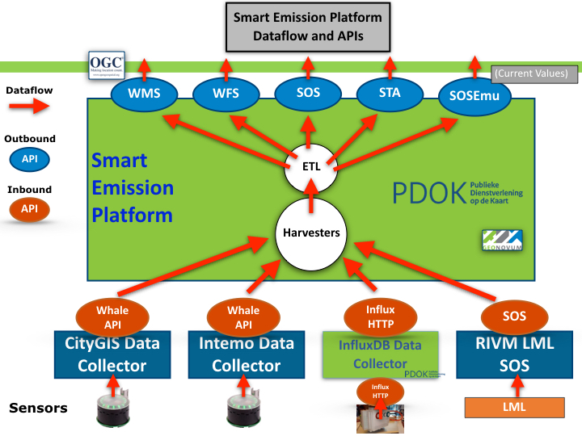

.. _apis:

=================
Dataflow and APIs
=================

This chapter focuses on dataflow and (external) protocol access to
the SE Platform via so called Application Programming Interfaces (APIs).

See the :ref:`architecture` and :ref:`data` chapters for the overall design and data
processing of the SE Platform.

Overview
========

This section sketches the global dataflow and introduces the main APIs.

   *Figure 1 - Global Dataflow and APIs*

Figure 1 above emphasizes the datastreams (red arrows) through the SE platform.

Data eventually always originates from sensors, mostly within stations like Intemo Josene or EU JRC AirSensEUR.
Sensors are shown at the bottom of figure 1. One of the first observations
is that sensors do not send their data directly to the SE Platform, but **push** measurements to
so called **Data Collectors** (drawn as squares). The SE Platform follows a **pull** model: data is
continuously fetched from Data Collectors using **Harvesters**.

Further following the flow of data, the ETL processes (as described in :ref:`data`) will eventually
push the refined (validated, optionally aggregated, converted and/or calibrated) data to various
API services that provide (mostly standard OGC) Web APIs from which clients (e.g. Web Viewer Apps), even
in theory another SE Harvester, can consume the data.

There are two groups of APIs: Inbound (producer) APIs (in orange) and Outbound (consumer) APIs (in blue).
In some cases the reason for an API-existence is historic: in the initial phase of the
project, experience needed to be gained with multiple APIs. A short overview follows.

Inbound APIs
------------

These are the APIs through which Harvesters pull (mainly raw) data into the platform.

Whale API a.k.a. Raw Sensor API
~~~~~~~~~~~~~~~~~~~~~~~~~~~~~~~

Via this API the SE Harvesters pull in data from Data Collectors.
This custom Web API was developed (by Robert Kieboom and Just van den Broecke)
specifically for the project. As
CityGIS already had developed a data collection server, but without
data refinement and OGC services, a way was needed to transfer data to the SE Platform.
A Pull/Harvesting model and API was chosen as it had advantages over a push-model:

* the SE Platform can pull-in data at its own pace
* resilient from restarts
* easier to deploy in an OTAP environment: e.g. both Test and Production servers can use the same Data Collectors

The `specification <https://github.com/Geonovum/smartemission/blob/master/docs/specs/rawsensor-api/rawsensor-api.txt>`_
and examples can be found in GitHub:
https://github.com/Geonovum/smartemission/tree/master/docs/specs/rawsensor-api.

The Whale API has two main services:

* fetch timeseries (history) data
* fetch latest data of any device

Devices in this case are Josene Sensors that contain multiple sensors, which together
provide over 40 indicators. The main classes are: gasses (for AQ), meteo (temperature etc),
sound pressure (noise), GPS and misc data like light intensity.

InfluxDB
~~~~~~~~

Mainly used for AirSensEUR (ASE). Each ASE (mostly hourly) pushes its data to a remote InfluxDB.
Per ASE station a single InfluxDB Measurement (equivalent of a regular DB Table) is used.

Just like the Whale API, InfluxDB also provides an HTTP API
to query Measurements and thus pull (harvest) timeseries data.

An InfluxDB instance can be remote or within the same server as the rest of the SE Platform.
This also provides a means to couple a push-based model to a pull-based model.

Sensor Observation Service (SOS)
~~~~~~~~~~~~~~~~~~~~~~~~~~~~~~~~

Data can be pulled from a remote SOS. For the SE platform this is used to pull in reference data
from RIVM for the ANN Calibration learning process. See also the :ref:`calibration` chapter.

Outbound APIs
-------------

These are the APIs from which clients pull (mainly refined/aggregated) data from the platform.

Web Map Service (WMS)
~~~~~~~~~~~~~~~~~~~~~

A WMS with plain image and time-dimension support is provided. This allows
clients to fetch images through history (e.g. with a timeslider in a web-viewer).
The WMS OGC Standard provide Dimension-support, in this case time as dimension.

Endpoint: http://data.smartemission.nl/geoserver/wms?service=WMS&request=GetCapabilities

Web Feature Service (WFS)
~~~~~~~~~~~~~~~~~~~~~~~~~

This allows downloading of timeseries data with geospatial filter-support.

Endpoint: http://data.smartemission.nl/geoserver/wfs?service=WFS&request=GetCapabilities

Sensor Observation Service (SOS)
~~~~~~~~~~~~~~~~~~~~~~~~~~~~~~~~

This provides a standard OGC SOS service: both the standard OGC versions 1 and 2, but
also the 52North-specific SOS REST service.

Endpoint: http://data.smartemission.nl/sos52n/service?service=SOS&request=GetCapabilities

SensorThings API (STA)
~~~~~~~~~~~~~~~~~~~~~~

This provides the SensorThings API, with requirements as SOS, but implemented much
more lightweight. In a nutshell: within STA an E/R-ike model of Entities (Things, Sensors, Datastreams, Observations etc)
are managed via HTTP verbs (like GET, PUT, PATCH etc).

NB the OGC STA standard also uses and integrates the IoT protocol MQTT. MQTT may be
used in future SE Platform versions.

Endpoint: http://data.smartemission.nl/gost/v1.0

SOSEmu API
~~~~~~~~~~

SOSEmu (SOS Emulator) has been developed early in the SE project, when SOS was
not yet available, and a way was needed to quickly gain access to (Josene) sensor data.
This API provides quick access to the latest (refined) data (no history support
of Josene devices and has no support for other sensor device types) of sensors.

The main/only user is the SmartApp. SOSEmu is intended to be phased out.

Endpoint: http://data.smartemission.nl/sosemu
