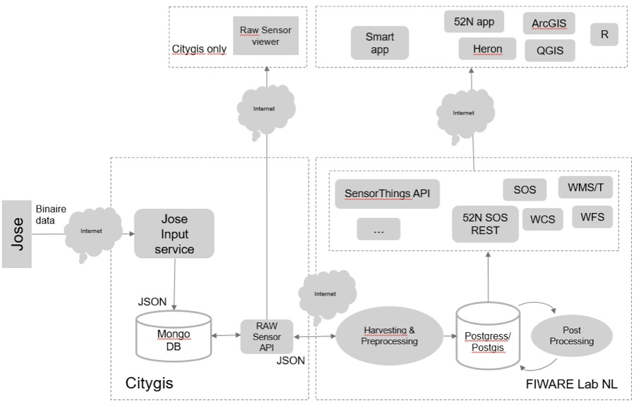
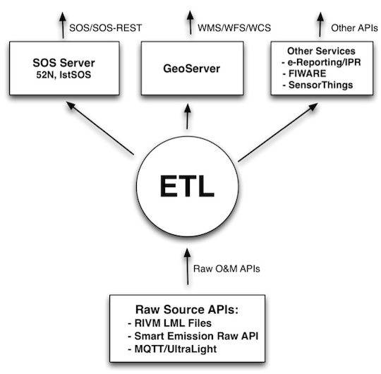
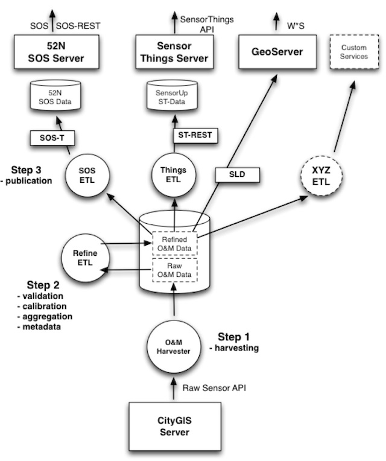
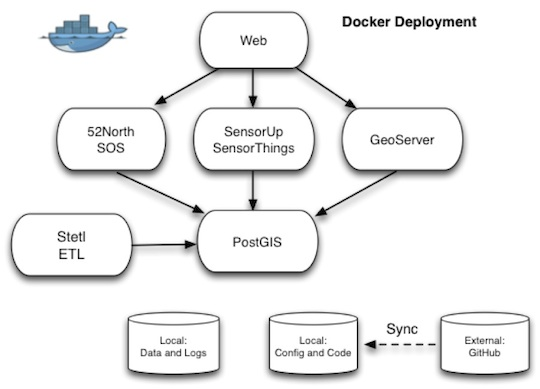
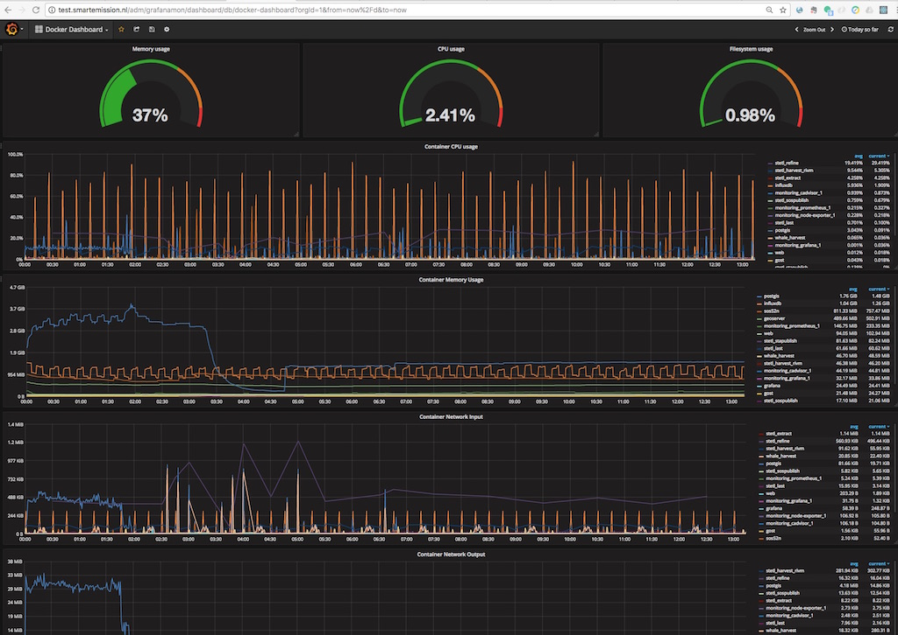

.. _architecture:

============
Architecture
============

This chapter describes the (software) architecture of the Smart Emission Data (Distribution) Platform.
A recent `presentation (PDF) <_static/dissemination/rivm-17jan2017/SmartEmission-RIVM-170117.pdf>`_ and
`this paper <_static/dissemination/sensorweb-munster-30aug2016/paper-munster-conf.pdf>`_
also may give more insight.

Global Architecture
===================

This section sketches "the big picture": how the Smart Emission Data Platform fits into an overall/global
architecture from sensor to citizen.

The Smart Emission (SE) global architecture starts with the collection of data from environmental
sensors (see Figure 1). The Jose sensor installation is connected to a power supply and to
the Internet. Internet connection is made by WIFI or telecommunication network (using a GSM chip).
The data streams are sent encrypted to a data production platform hosted by company CityGIS.
The encrypted data is decrypted by a dedicated "Jose Input Service" that also inserts the data
streams into a MongoDB database using JSON. This MongoDB database is the source production database
where all raw sensor data streams of the Jose Sensor installation are stored. A dedicated
REST API – the Raw Sensor API - is developed by CityGIS and Geonovum for
further distribution of the SE data to other platforms, like the SE Data Distribution platform
hosted at the FIWARE Lab NL (**NB FIWARE has been skipped**) and the main subject of this chapter.

   *Figure 1 - Smart Emission Global Data Architecture*

The global data infrastructure consists of:

* ETL-based pre- and post-processing algorithms;
* data storage in Postgres/PostGIS;
* several OGC based APIs.
* several apps and viewers like the ``SmartApp`` and ``Heron``

In order to store the relevant SE data in the distribution database harvesting and pre-processing of the
raw sensor data (from the CityGIS production platform) is performed. First, every N minutes a harvesting
mechanism collects sensor-data from the production platform using the Raw Sensor API. The data encoded in
JSON is then processed by a multi-step ETL-based pre-processing mechanism. In several steps the data streams
are transformed to the Postgres database. For instance, pre-processing is done specifically for the raw data
from the air quality sensors. Based on a calibration activity in de SE project, the raw data from the air
quality sensors is transformed to ‘better interpretable’ values. Post-processing is the activity to transform
the pre-processed values into new types of data using statistics (aggregations), spatial interpolations, etc..

The design of the Smart Emission Data Platform is further expanded below.

Data Platform Architecture
==========================

Figure 2 below sketches the overall architecture with an emphasis on
the flow of data (arrows). Circles depict harvesting/ETL processes.
Server-instances are in rectangles. Datastores the "DB"-cons.

   *Figure 2 - Smart Emission Data Platform ETL Context*

This global architecture is elaborated in more detail below. Figure 3 sketches a multistep-ETL approach as used
within the `SOSPilot project <http://sensors.geonovum.nl>`_. Here Dutch Open Air Quality Data provided through
web services by RIVM (LML) was gathered and offered via OGC SOS and W*S services in three steps:
Harvesting, Preprocessing and Publishing, the latter e.g. via SOS-T(ransactional).
The main difference/extension to RIVM LML ETL processing is that the Smart Emission raw O&M data is not
yet validated (e.g. has outliers), calibrated and aggregated (e.g. no hourly averages). Also we need to cater
for publication to the  `Sensor Things API Server (STA GOST) <https://www.gostserver.xyz/>`_).

   *Figure 3 - Smart Emission Data Platform ETL Details*

The ETL design comprises these main processing steps:

* Step 1: *Harvester*: fetch raw O&M data from the CityGIS server via the Raw Sensor API
* Step 2: *Refiner*: validate, calibrate and aggregate the Raw O&M Data, rendering Refined O&M Data with metadata. The datastore is Postgres with PostGIS.
* Step 3: *Publisher*. Publish to various services, some having internal (PostGIS) datastores.

The services to be published to are:

* *SOS ETL*: transform and publish to the 52N SOS DB via SOS-Transactional (SOS-T)
* *Things ETL*:  transform and publish to the Geodan GOST SensorThings API (STA, via REST)
* Publication via *GeoServer* WMS (needs SLDs) and WFS directly
* *XYZ*: any other ETL, e.g. providing bulk download as CSV

Some more notes for the above dataflows:

* The central DB will be Postgres with PostGIS enabled
* Refined O&M data can be directly used for OWS (WMS/WFS) services via GeoServer (using SLDs and a PostGIS datastore with selection VIEWs, e.g. last values of component X)
* The SOS ETL process transforms refined O&M data to SOS Observations and publishes these via the SOS-T InsertObservation service. Stations are published once via the InsertSensor service.
* Publication to the GOST SensorThings Server goes via the STA REST service
* These three ETL steps run continuously (via Linux cronjobs)
* Each ETL-process applies “progress-tracking” by maintaining persistent  checkpoint data. Consequently a process always knows where to resume, even after its (cron)job has been stopped or canceled. All processes can even be replayed from *time zero*.

Deployment
==========

`Docker <https://www.docker.com>`_ is the main building block for the SE Data Platform deployment architecture.

`Docker <https://www.docker.com>`_
*...allows you to package an application with all of its dependencies into a standardized unit for software development.*.
Read more  on https://docs.docker.com.

The details of Docker are not discussed here, there are ample sources on the web. One of the best,
if not the best, introductory books on Docker is `The Docker Book <https://www.dockerbook.com>`_.

Docker Strategy
---------------

Components from the Smart Emission Data Platform as
described in the architecture above are deployed using Docker. Docker is a
common computing container technology also used extensively within Dutch Kadaster. By using Docker we can create
reusable high-level components, “Containers”, that can be built and run within multiple contexts.
Figure 4 sketches the Docker deployment. The entities denote Docker Containers, the arrows linking.
Like in Object Oriented Design there are still various strategies and patterns to follow with Docker.
There is a myriad of choices how to define Docker Images, configure and run Containers etc.
Within the SE Platform the following strategies are followed:

* define only generic/reusable Docker Images, i.e. without SE-specific config/functions
* let each Docker image perform a single (server) task: Apache2, GeoServer, PostGIS, 52NSOS etc.
* keep all configuration, data, logfiles and dynamic data outside Docker container on the Docker host
* at runtime provision the Docker Container with local mappings to data, ports and other Docker containers

The Docker Containers as sketched in Figure 4 are deployed.

   *Figure 4 - Docker Deployment - Container View*

Docker Containers will be created/used for:

* ``Web``  front-end (Apache2) webserving (viewers/apps)  and proxy to backend web-APIs
* ``GeoServer``  : container with Tomcat running GeoServer
* ``52North_SOS`` : container with Tomcat running 52North SOS
* ``SensorThings API`` : container running Geodan GOST SensorThings API Server
* ``Stetl`` : container for the Python-based ETL framework used
* ``PostGIS`` : container running PostgreSQL with PostGIS extension
* ``InfluxDB``: container running InfluxDB server from `InfluxData <https://www.influxdata.com>`_
* ``Chronograf``: container running Chronograf (InfluxDB Admin) from `InfluxData <https://www.influxdata.com>`_
* ``Grafana``: container running Grafana Dashboard
* ``MQTT``: container running Mosquitto MQTT
* ``NodeRed``: container running NodeRed Dashboard

The *Networking and Linking* capabilities of Docker will be applied to link Docker Containers,
for example to link GeoServer  and the other application servers to PostGIS.
Docker Networking may be even applied (VM-) location independent, thus when required
Containers may be distributed over VM-instances. Another aspect in our Docker-approach
is that all data, logging, configuration and custom code/(web)content is maintained
*Local*, i.e. outside Docker Containers/images. This will make the Docker Containers
more reusable and will provide better control, backup, and monitoring facilities.
An *Administrative Docker Component* is also present. Code, content and configuration
is maintained/synced in/with GitHub (see below).  Custom(ized) Docker Containers will
be published to the Docker Hub, to facilitate immediate reuse.

The list of Docker Containers, each with their related Docker Image:

* ``web`` - web and webapps, proxy to backend - image: ``geonovum/apache2``
* ``postgis`` - PostgreSQL w PostGIS - image: ``geonovum/postgis`` based on ``kartoza/postgis:9.4-2.1``
* ``stetl`` - All ETL tasks - image: ``geonovum/stetl``
* ``geoserver`` - GeoServer web app - image: ``geonovum/geoserver`` based on ``kartoza/geoserver``
* ``sos52n`` - 52North SOS web app -  - image: ``geonovum/sos52n``
* ``influxdb`` - InfluxDB Timeseries DB - image: ``influxdb:1.1.1`` (from `DockerHub <https://hub.docker.com/_/influxdb/>`_)
* ``chronograf`` - InfluxDB Timeseries DB admin - image: ``chronograf:1.4`` (from `DockerHub <https://hub.docker.com/_/chronograf/>`_)
* ``grafana`` - InfluxDB Timeseries DB - image: ``grafana/grafana:4.1.1`` (from http://docs.grafana.org/installation/docker/)
* ``gost`` - GOST from Geodan - image: https://hub.docker.com/r/geodan/gost/
* ``mosquitto``: container running Mosquitto MQTT - image: ``toke/mosquitto``
* ``nodered``: container running NodeRed Dashboard - image ``nodered/node-red-docker``

See https://github.com/Geonovum/smartemission/blob/master/docker for the generic images
and https://github.com/Geonovum/smartemission/blob/master/etl
and https://github.com/Geonovum/smartemission/blob/master/services
for their use/deployment in Docker Containers.

Test and Production
-------------------

In order to provide a continuous/uninterrupted service both a
Test and Production deployment has been
setup. For local development on PC/Mac/Linux
a Vagrant environment with Docker can be setup.

The Test and Production environments have separate IP-adresses and domains:
`test.smartemission.nl <http://test.smartemission.nl>`_
and  `data.smartemission.nl  <http://data.smartemission.nl>`_ respectively.

Monitoring
----------

The `challenge <https://dzone.com/refcardz/intro-to-docker-monitoring>`_ is to monitor services contained in Docker.

Monitoring is based around `Prometheus <https://prometheus.io>`_  and a dedicated (for monitoring) Grafana
instance. A complete monitoring stack is deployed via `docker-compose` based on the
`Docker Monitoring Project <https://github.com/vegasbrianc/prometheus/tree/version-2>`_.
In the future `this approach by Stefan Prodan <https://github.com/stefanprodan/dockprom>`_ is worthwhile.

   *Figure 5 - Docker Monitoring in SE*
