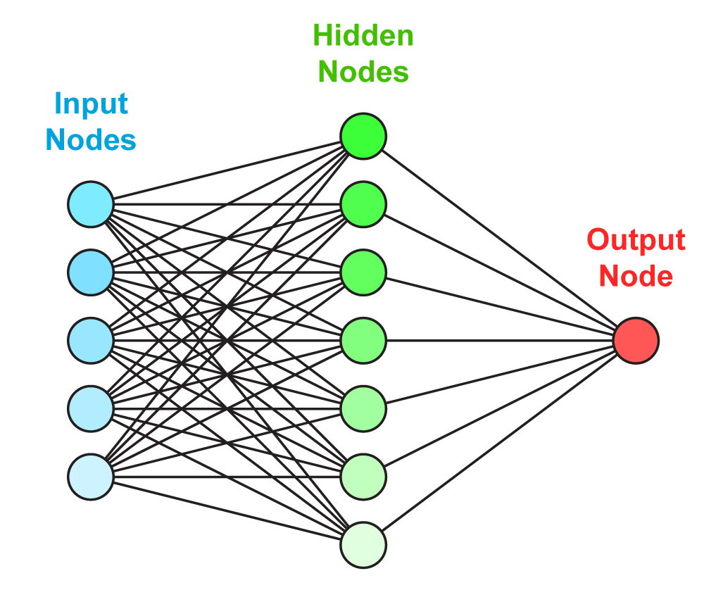

.. _calibration:

===========
Calibration
===========

The Jose sensors produce noisy and biased measurements of gas components on a wrong scale. The data is noisy because
two consecutive measurements of the same gas component can vary a lot. The measurements are biased because the gas
sensors are cross sensitive for (at least) temperature and other gas components. The measurements are on the wrong
scale because the results in kOhm instead of the more interpretable ug/m^2 or ppm.

To solve these issues Jose sensor is calibrated using RIVM measurements of the same gas components (see "Data").
After the calibration the gas concentrations that RIVM would measure on the same location can be predicted. Before
calibration the data from Jose and RIVM is preprocessed to obtain a data set suitable for machine learning (see
"Pre-processing"). An artificial neural network is used to model the relationship (see "Neural networks" and
"Training a neural network"). To compare several models cross validation and the Root Mean Squared Error  is used (see
"Performance evaluation"). Multiple models are learned from which the best is chosen (see "Parameter optimization"
and "Choosing the best model"). This model is used to predict RIVM measurements (see "Online prediction").

Data
====

The used data comes from two pairs of Jose and RIVM sensors that are located close to each other. One pair of Jose
and RIVM sensors is located at the Graafseweg, close to the Keizer Karelplein. The other pair is located at the
Ruyterstraat in Nijmegen.

Data was gathered for a period of february 2016 to *now*.

Data from RIVM is delivered by Jan Vonk from the RIVM. Data from the Jose sensors is delivered by Robert Kieboom.

The RIVM data has a record for every minute. The Jose data is more irregular because sometimes the sensors were not
on or wifi connection was lost. When available about 3 measurements per minute are provided.

Pre-processing
==============

Before using the data form Jose and RIVM it needs to be pre-processed:

* Erroneous measurements are removed based on the error logs from RIVM and Jose.
* Extremely unlikely measurements are removed (e.g. gas concentrations below 0)
* The RIVM data is interpolated to each time a Jose measurement was taken.
* The RIVM data is merged with the Jose data. For each Jose measurement the corresponding RIVM measurements are now
  known.
* A rolling mean is applied to the gas components of the Jose data. Actually this step is done during the parameter
optimization to find out which length of rolling mean should be used.
* A random subset of 10% of the data is chosen to prevent redundant measurements. Actually this step is done during
the parameter optimization.

The pre-processing is done in R.

Neural networks
===============

There are several options to model the relationship between the Jose measurements and RIVM measurements. For this
project is chosen for a feed-forward neural network. Its advantage is that it can model complex non-linear relations.
The disadvantage is that understanding the model is hard.

A neural network can be though of as a graph (see Figure 1). A graph contains nodes and edges. The neural network
specifies the relation between the input nodes and output nodes by several edges and hidden layers. The values for
the input nodes are clamped to the independent variables in the data set, i.e. the Jose measurements. The value of the
output node should be as close as possible to the dependent variable, i.e. the RIVM measurement.

The hidden nodes take a weighted average (resembled by de edges to each of the inputs) and then apply an activation
function. The activation function squashes the weighted average to a finite range (e.g. [-1, 1]). This allows the
neural network to transform the inputs in a non-linear way to the output variable.

   *Figure 1 - The structure of a feed-forward neural network can be visualized as a graph*

.. alternatives

Training a neural network
=========================

.. input output specification

A neural network is completely specified by the the weights between the nodes and the activation function of the
nodes. The latter is specified on beforehand and thus only the weights should be learned during the training phase.

There is no way of efficiently finding the optimal weights of an arbitrary neural network. Therefore, a lot of
methods are proposed to iteratively approach the global optimum.

Most of them are based on the idea of back-propagation. With *back-propagation* the error for each of the records in
the data is used to change the weights slightly. The change in weights makes the error for that specific record lower
. However, it might increase the error on other records. Therefore, only a tiny alteration is made for each error in
each record.

As an addition the used `L-BFGS method <https://en.wikipedia.org/wiki/Limited-memory_BFGS>`_ also uses the first and
second derivatives of the error function to converge faster to a solution.

Performance evaluation
======================

To evaluate the performance of the model the
`Root Mean Squared Error <https://en.wikipedia.org/wiki/Root-mean-square_deviation>`_ (RMSE) is used. In other words,
the RMSE is the average error (prediction - actual value) of the model. Lower RMSE are better.

Testing the model on the same data as it is trained on could lead to over-fitting. This means that the model learn
relations that are not there in practice. Because the same data is used to asses the performance of the model this
would not be unveiled. For this reason the performance evaluation needs to be done on different data then the
learning of the model. For example, 90% of the data is used to train the model and 10% is used to test the model.
This process can be repeated when using a different 10% to test the data. With the 90%-10% ratio this process can be
repeated 10 times. This is called cross validation. In practice, cross validation with 5 different splits of the data
is used.

Parameter optimization
======================

Training a neural network optimizes the weights between the nodes. However, the training process is also susceptible
to parameters. For example, the number of hidden nodes, the activation function of the hidden nodes, the learning
rate, etc. can be set. For a complete list of all the parameters see the
`documentation of MLPRegressor <http://scikit-learn.org/dev/modules/generated/sklearn.neural_network.MLPRegressor
.html#sklearn.neural_network.MLPRegressor>`_.

Choosing different parameters for the neural network learning influences the performance and complexity of the model.
For example, using to little hidden nodes results in a model that cannot fit the pattern in the data. On the other
side, using to many hidden nodes models a relationship that is to complex and does not generalize to new data.

Parameter optimization is the process of evaluating different parameters.
`RandomizedSearchCV <http://scikit-learn.org/stable/modules/generated/sklearn.grid_search.GridSearchCV.html#sklearn
.grid_search.GridSearchCV>`_
from sklearn is used to try different parameters and evaluate them using cross-validation. This method trains and
evaluates a neural network n_iter times. The actual code looks like this: ::

     gs = RandomizedSearchCV(gs_pipe, grid, n_iter, measure_rmse, n_jobs=n_jobs, cv=cv_k, verbose=verbose,
                                error_score=np.NaN)
     gs.fit(x, y)

The first argument *gs_pipe* is the pipeline that filters the data and applies a neural network, *grid* is a collection
with distributions of possible parameters, *n_iter* is the number of parameters to try, *measure_rmse* is a function
that computes the RMSE performance and *cv_k* specifies the number of cross-validations to run for each parameter
setting. The other parameters control the process.

.. show image of cross validation

Choosing the best model
=======================

A good model has a good performance but is also as simple as possible. Simpler models are less likely to over-fit, i.e
simple models are less likely to fit relations that do not generalize to new data. For this reason, the simplest
model that performs about as well (e.g. 1 standard deviation) as the best model is selected.

For each gas component this results in models with different learning parameters. Differences are in the size of the
hidden layers, the learning rate, the regularization parameter, the momentum and the activation function. For more
information about these parameters check the
`documentation of MLPRegressor <http://scikit-learn.org/dev/modules/generated/sklearn.neural_network.MLPRegressor
.html#sklearn.neural_network.MLPRegressor>`_.
The parameters for each gas component are listed below: ::

    CO_final = {'mlp__hidden_layer_sizes': [56],
                'mlp__learning_rate_init': [0.000052997],
                'mlp__alpha': [0.0132466772],
                'mlp__momentum': [0.3377605568],
                'mlp__activation': ['relu'],
                'mlp__algorithm': ['l-bfgs'],
                'filter__alpha': [0.005]}

    O3_final = {'mlp__hidden_layer_sizes': [42],
                'mlp__learning_rate_init': [0.220055322],
                'mlp__alpha': [0.2645091504],
                'mlp__momentum': [0.7904790613],
                'mlp__activation': ['logistic'],
                'mlp__algorithm': ['l-bfgs'],
                'filter__alpha': [0.005]}

    NO2_final = {'mlp__hidden_layer_sizes': [79],
                 'mlp__learning_rate_init': [0.0045013008],
                 'mlp__alpha': [0.1382210543],
                 'mlp__momentum': [0.473310471],
                 'mlp__activation': ['tanh'],
                 'mlp__algorithm': ['l-bfgs'],
                 'filter__alpha': [0.005]}

Online predictions
==================

The sensorconverters.py converter has routines to refine the Jose data. Here the raw Jose measurements for meteo and
gas components are used to predict the hypothetical RIVM measurements of the gas components.

Three steps are taken to convert the raw Jose measurement to hypothetical RIVM measurements.

* The measurements are converted to the units with which the model is learned. For gas components this is kOhm, for
  temperature this is Celsius, humidity is in percent and pressure in hPa.

* A rolling mean removes extreme measurements. Currently the previous rolling mean has a weight of 0.995 and the ne
  value a weight of 0.005. Thus alpha is 0.005 in the following code: ::

    def running_mean(previous_val, new_val, alpha):
        if new_val is None:
            return previous_val

        if previous_val is None:
            previous_val = new_val
        val = new_val * alpha + previous_val * (1.0 - alpha)
        return val

* For each gas component a neural network model is used to predict the hypothetical RIVM measurements. Prediction
  are only made when all gas components are available. The actual prediction is made with this code: ::

    value_array = np.array([s_barometer, s_humidity, s_temperatureambient, s_temperatureunit, o3_running_means['co'],
                            o3_running_means['no2'], o3_running_means['o3']]).reshape(1, -1)
    with open(pipeline_objects['o3'], 'rb') as f:
        # s = f.read()
        o3_pipeline = pickle.load(f)
    val = o3_pipeline.predict(value_array)[0]

