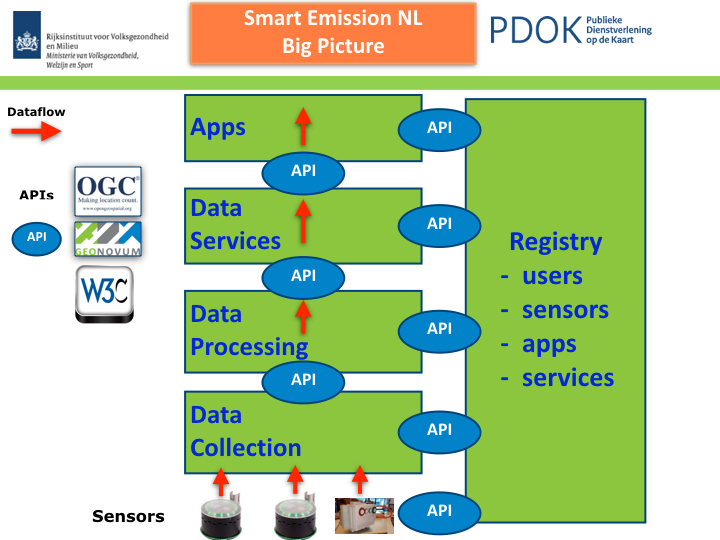
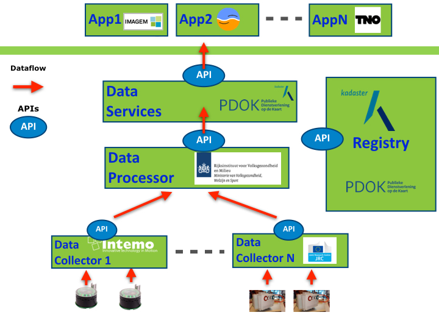

.. _evolution:

=========
Evolution
=========

By: Just van den Broecke - v1 - March 2, 2018 - written @Kadaster/PDOK.

This is a chapter from the full Smart Emission platform documentation found at
`http://smartplatform.readthedocs.io <http://smartplatform.readthedocs.io>`_

This chapter focuses on possible future evolution scenarios for the Smart Emission platform.

See the :ref:`architecture`, :ref:`data`, :ref:`components` and :ref:`apis` chapters for the overall design and data
processing, APIs and dataflow of the SE Platform.

Introduction
============

Within the world of SensorWeb and IoT, many platforms are developed and offered.
Some with Open Source, others with proprietary source. Data may be Open, partially Open or completely closed.
Same goes for standards and APIs used for (web) services. Some platforms are
"end-to-end complete": they include data acquisition from sensors, data management/storage,
services and viewers, often in the form of a "Portal" and "Dashboards". Most of these portals
are built with proprietary source, use custom APIs and usually provide
subscription models ("Cloud Services") for end users. Also data is usually hosted
at major providers like Amazon and Google, most often not within The Netherlands.
Licensing models may change at will. But the convenience is great, often
plug-and-play integrations (like with ThingsNetwork).
Examples are numerous, we mention just `MyDevices Cayenne <https://cayenne.mydevices.com>`_ and
`OpenSensors <https://opensensors.com/>`_.

This chapter is not to list and review all major sensor/IoT platforms, but puts focus on a a very high level
functional architecture applied to sensor network initiatives within The Netherlands.

Components
==========

This section sketches a global and distributed component architecture.
From several sensor network projects, including Smart Emission, and discussions
a high-level, global architecture emerged of functional building blocks connected via APIs (Standards).
This is sketched in **Figure 1** below.

   *Figure 1 - Global Component Architecture*

Figure 1 above uses three drawing elements:

* the green rectangles denote functional blocks
* the red arrows denote the flow of sensor data
* the oval elements called "API" denote standardized interaction between functional blocks

Furthermore:

* functional blocks may be distributed over servers  (or in same server)
* relations between these blocks may be multiple (many-to-many)
* functional blocks may be provided and maintained by different organizations/companies

The image sketches an architecture on the basis of minimal Coupling and maximum Cohesion: blocks have
minimal (API) couplings and are maximally cohesive, i.e. perform only specific tasks.

What follows is a short description of the functions of each block and its relations to other blocks, starting
at the bottom, following the flow of (sensor) data.

Data Collection
---------------

This block in practice provides one or more **Data Collectors**. Sensors need to
send their data to "somewhere". Often it is good practice to have a "buffer", here called a Data Collector
that initially receives and stores the data from sensors and makes
it available via an API.

Examples: within the SE Platform, raw data from Josene sensors is sent using low-level protocols (MQTT)
to Data Collectors provided by Intemo and CityGIS. These provide storage and the "Whale API" from
which any other platform SE or RIVM can obtain, i.e. **harvest** that raw sensor-data.

Another Data Collector within the SE platform is an `InfluxDB` timeseries database to which for example
the EU JRC AirSensEUR stations send their raw sensor data.

The big advantage of this approach is that:

* sensors only need to know a single destination (address) for their data
* there may be multiple raw data consumers (e.g. SE, RIVM) or OTAP streets
* history function: data may be collected and stored for longer periods

The result of this block is that raw sensor-data (timeseries) is stored and made available
to multiple consumers. But the data is still "raw", not yet suitable for applications.

NB in addition it is convenient that a Data Collector API always provides a "current/last" dataset from
all sensors to data consumers, to allow near-realtime datastreams.

Data Processing
---------------

Sensor data provided by Data Collectors is consumed, usually via **harvesting** by **Data Processors**.
These provide in general the following refinement steps on the raw sensor data:

* validation: removing "outliers", bad data in general
* conversion: convert units, e.g. from Kelvin to Celsius for temperature
* calibration: provide calibration, e.g. via linear methods, Artificial Neural Networks (ANN)
* aggregation: make averages like hour or 5 minute-values, data reduction

Not all Data Processors will provide all these functions, and implementations may greatly differ.

In the end each Data Processor will make its "refined" data available for the next step: Data Services.

Data Services
-------------

A **Data Service** in general provides usually a Web API through which consumers, mainly
Applications can utilize the refined sensor-data by the Data Processors.

In this block Web Service APIs are found: when standardized these are often OGC-based like
the Sensor Observation Service, the SensorThings API (STA), but also WMS and WFS.

For example the SE platform provides currently (feb 2018) five APIs: WMS (Time), WFS, SOS, STA and a properietary
REST API for current sensor-values. For SOS and STA **Data Publishers** are defined
that push data from Data Processors to these respective services (via SOS-T and STA REST PUT).

Apps
----

Apps are web-based, desktop or mobile applications that consume refined sensor-data provided via
the (standardized) APIs of the Data Services.

For example within the SE project several "Viewers" were developed. Some internal within
the project like the heron and SmartApp, some external like viewers from Imagem and TNO.

Registry
--------

This building block is global to all the other building blocks discussed above.
Its functions may be distributed over several actual components and may include:

* sensor registration: location, owner etc
* sensor metadata, the properties of the sensor
* user registration: sensor ownership, access constraints
* service registration: available services, service URLs etc
* apps registration: as for services:

This block mainly deals with data and APIs "other than the sensor-data (and APIs)".
Often this is refered to as **Metadata (MD)** and MD APIs.

This block is often overlooked in projects. At least within the SE Platform it has not been
explicitly defined as initially there was just one sensor/device type and no users
registered. But like in other geospatial architectures this aspect should be taken into account.

APIs and Standards
==================

The success of the above architecture has a prominent role for APIs.
Especially when building blocks are developed and deployed in a distributed fashion
by different organizations.

A few recommendations based on experience within the SE project.

SensorThings API (STA)
----------------------

The SensorThings API is a relatively new OGC standard.
It provides similar functions as SOS, but
more "modern" and lightweight.

In a nutshell: within STA an E/R-ike model of Entities (Things, Sensors, Datastreams, Observations etc)
are managed via HTTP verbs (like GET, PUT, PATCH etc).

The OGC STA standard also uses and integrates the IoT protocol MQTT.

Usage: STA could be applied for several APIs within the above architecture:

* Sensors to Data Collectors (using MQTT)
* Data Services to Apps

Whale API a.k.a. Raw Sensor API
-------------------------------

Via this API the SE Harvesters pulled in data from Data Collectors.
This custom Web API was developed (by Robert Kieboom and Just van den Broecke)
specifically for the SE project. It proved very convenient to
**harvest** bulk timeseries raw sensor-data.

The Whale API has two main services:

* fetch timeseries (history) data
* fetch latest data of any device ("last" values)

The `specification <https://github.com/smartemission/smartemission/blob/master/docs/specs/rawsensor-api/rawsensor-api.txt>`_
and examples can be found in GitHub:
https://github.com/smartemission/smartemission/tree/master/docs/specs/rawsensor-api.

Sensor Observation Service (SOS)
--------------------------------

After several years of experience, we don't recommend using SOS:

* bulky data (XML)
* hard to understand by developers
* hard to manage via SOS-T (e.g. moving sensors)
* only two mature Open Source implementation
* interworking problems (see QGIS SOS plugins)

Though some providers have developed a "SOS-REST" API with JSON data formats these are
product-specific and thus proprietary.

Though SensorThings API is very recent and implementations may need to mature, for
the future STA seems a better option.

Web Map Service (WMS)
---------------------

A WMS with plain image and time-dimension support. This allows
clients to fetch images through history (e.g. with a timeslider in a web-viewer).
The WMS OGC Standard provide Dimension-support, in this case time as dimension.

Web Feature Service (WFS)
-------------------------

This allows downloading of timeseries data with geospatial filter-support.

Though WFS could be replaced functionally by SensorThings API.

All in all: what is important is to:

* recognize which APIs are required
* which existing APIs (standards) to choose
* filling in options in these standards (profiling)
* provide Open Source examples/implementations

Federated Architecture
======================

The above architecure could be implemented by multiple organizations. For example
on the (Dutch) national level scenarios can be envisioned where local and governmental
organizations and parties "from the market" each fill-in functional blocks based on their specialization.
This could result in what could be called a **Federated Architecture**, i.e. no single party
provides/controls all building blocks. In theory any party could join (via the APIs and Registry).

A good example of such a federated architecture brought
to practice is `The ThingsNetwork (TTN) <https://www.thethingsnetwork.org/>`_, a community-driven
LoRaWAN network based on well-defined components and APIs. Setup for different purpose and domain but
working very well in practice because of well-defined building blocks and APIs, making
it extensible as any party can join and add a building block.
A Forum with community managers and a central website
with documentation, info and portal functions also has a great role in TTN.

Back to Smart Emission evolution and expanding the architecture from Figure 1.
For example, roles for blocks (and thus API providers) could be divided as follows:

* Intemo, EU JRC: Data Collection
* RIVM: Data Processing
* Kadaster: Data Services (via PDOK), Registry

But this division does not need to be that strict. For example RIVM
may also host Data Collectors and/or provide Data Services. The point is again: a federated architecture
composed by well-defined building blocks and APIs.

"The market", or any other organization would provide the Apps, sensors
and Data Collectors.

Again, for this to work, agreements on APIs have to be made and favourably
components would be developed and reused with Open Source.

   *Figure 2 - Federated Architecture Example*

An (fictional!) example is provided in the Figure above.
The roles are not fixed but just for the example.
The actual APIs need to be worked out. For the latter we foresee
a role for Geonovum, selecting and profiling standards from mainly OGC and W3C.
