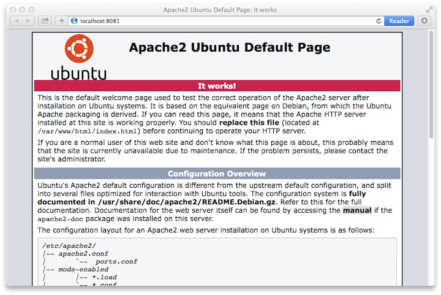

.. _installation:

============
Installation
============

This chapter describes the installation steps for the Smart Emission Data Platform.

Principles
==========

These are requirements and principles to understand and install an instance of the SE platform.
It is required to have an understanding of `Docker <https://www.docker.com>`_, as that is the main environment
in which the SE Platform is run.

- Required OS: Ubuntu Linux 14.04 or later (tested on 14.04)
- all components are Docker Images run as Docker Containers
- all required code comes from GitHub: https://github.com/Geonovum/smartemission
- all dynamic data: settings, databases, logfiles is maintained on the system (via Docker container *Volume-mapping*)
- Docker images are connected via Docker Link (``--link``)  mapping
- all access to application services containers (GeoServer, SOS, Grafana etc) runs via the Apache2 `web` Docker container
- settings per-system, like for test and production are kept in per-host ``<yourhostname>.args``
- dynamic data (databases, logs, backups) is maintained under ``/var/smartem``.
- a single ``bootstrap.sh`` script will install ``Docker`` plus other required packages (see below)
- all ETL/calibration processes run as scheduled ``cron`` jobs
- all ETL Processes use a single Docker Image that embeds the `Stetl ETL Tool <http://stetl.org>`_
- maintain ETL functionality in GitHub and just refresh/pull GitHub dir on server (no need for rebuilding Docker)
- backups for all configuration and databases is scheduled each midnight
- a test http://test.smartemission.nl and production http://data.smartemission.nl server exists

Installation
============

There are just a few commands to install and initialize the entire SE Platform.
To install the entire platform on a bare Ubuntu Linux on an empty Virtual Machine (VM),
make all databases ready and run/schedule (``cron``) all processes can be done within 15-30 minutes.

On an empty Ubuntu Linux system perform all the steps below in that order as user ``root``.

Get Bootstrap Script
--------------------

Get the SE Platform `bootstrap.sh <https://github.com/Geonovum/smartemission/platform/bootstrap.sh>`_ script: ::

    # In e.g. home dir
    $ apt-get install curl
    $ curl -O https://raw.githubusercontent.com/Geonovum/smartemission/master/platform/bootstrap.sh

Install and Build
-----------------

Within this dir do the following steps to install packages and
SE-code (from GitHub) and build Docker images: ::

    # become root if not already
    $ sudo su  -

    # Install Docker and required packages
    # plus checkout (Git) all SE code from GitHub
    # Confirm interactive choices: postfix "Local".
    $ ./bootstrap.sh

    # go platform home dir:
    $ cd /opt/geonovum/smartem/git/platform

    # Tip: make dynamic link to quickly access GitHub code dir from ~/git
    cd
    ln -s /opt/geonovum/smartem/git git

    # build all Docker images (be patient)
    $ ./build.sh

Configure
---------

Next configure and install databases and ETL-options. First make your own host-dependent
configuration file as a copy
from `example.args <https://github.com/Geonovum/smartemission/etl/options/example.args>`_: ::

    # Go to config options dir
    $ cd /opt/geonovum/smartem/git/etl/options

    # Note your machine's hostname, symbolically "yourhostname"
    $ hostname
    yourhostname

    # Make copy of the example config file
    # NB never put this file in GitHub or public dir!!
    $ cp example.args  yourhostname.args

    # Change the config values for your local situation
    $ vi yourhostname.args

    # Create a HTTP admin password file named 'htpasswd' See README.TXT there.
    cd /opt/geonovum/smartem/git/services/web/config/admin
    htpasswd htpasswd <username>

Create Databases
----------------

Now create and initialize all databases (PostGIS and InfluxDb): ::

    # Creates and initializes all databases
    # NB WILL DESTROY ANY EXISTING DATA!!
    ./init-databases.sh

Install System Service
----------------------

The entire platform (all Docker Images and `cron jobs <https://github.com/Geonovum/smartemission/platform/cronfile.txt>`_) can be started/stopped with single
system service command `smartem <https://github.com/Geonovum/smartemission/platform/smartem.initd.sh>`_ : ::

    # Installs Linux system service "smartem" in /etc/init.d
    ./install.sh

    # Test (see Running below)
    service smartem status

    # in browser: go to http://<yourdomain>/geoserver and
    # change GeoServer default password (admin, geoserver)

Running
=======

The entire SE-platform (all Docker Images and cron jobs) can be
started/stopped/inspected via Linux "service smartem" commands:  ::

	service smartem status
	service smarted stop
	service smartem start

etc or even ``/etc/init.d/smartem start|stop|status`` will work.

The link http://data.smartemission.nl/adm gives access to admin pages.

Checking status: ::

    $ service smartem status
    * Checking status of Smart Emission Data Platform smartem                                                                                                                         CONTAINER ID        IMAGE                      COMMAND                  CREATED             STATUS              PORTS                                            NAMES
    938924fff0a3        geonovum/stetl:latest      "/usr/local/bin/st..."   20 seconds ago      Up 19 seconds                                                        stetl_sospublish
    dd598dbd1e0f        geonovum/apache2           "/usr/bin/supervisord"   3 weeks ago         Up 3 weeks          22/tcp, 0.0.0.0:80->80/tcp                       web
    2dcd2b91a7a1        grafana/grafana:4.1.1      "/run.sh"                3 weeks ago         Up 3 weeks          0.0.0.0:3000->3000/tcp                           grafana
    573c839c7bab        geonovum/sos52n:4.3.7      "catalina.sh run"        3 weeks ago         Up 3 weeks          8080/tcp                                         sos52n
    aa16f2e456f6        geonovum/geoserver:2.9.0   "catalina.sh run"        3 weeks ago         Up 3 weeks          8080/tcp                                         geoserver
    f915fc5d1d2b        influxdb:1.1.1             "/entrypoint.sh -c..."   3 weeks ago         Up 2 weeks          0.0.0.0:8083->8083/tcp, 0.0.0.0:8086->8086/tcp   influxdb
    08b5decd0123        geonovum/postgis:9.4-2.1   "/bin/sh -c /start..."   3 weeks ago         Up 3 weeks          5432/tcp                                         postgis

    # List cronjobs
    $ crontab -l

Handy Commands
--------------

Some handy Docker commands: ::

    # cleanup non-running images
    $ sudo docker rm -v $(sudo docker ps -a -q -f status=exited)
    $ sudo docker rmi $(sudo docker images -f "dangling=true" -q)

    # go into docker image named apache2 to bash prompt
    sudo docker exec -it apache2 bash

    # Find local Docker Bridge address of running container
    docker inspect --format '{{ .NetworkSettings.IPAddress }}' postgis
    # Example: psql to local postgis container
    psql -h `docker inspect --format '{{ .NetworkSettings.IPAddress }}' postgis` -U docker -W gis

Docker Containers
=================

Below the Docker Containers:
how their generic Docker Images are built/acquired and how they are run using local mappings, data and configs.

Each Docker image build is found under ``/docker`` in GitHub. Docker Containers
are run via subdirs under ``services``.

postgis - PostGIS Database
--------------------------

Uses PostGIS Docker image from Kartoza (Tim Sutton, QGIS lead),
see https://hub.docker.com/r/kartoza/postgis/ and https://github.com/kartoza/docker-postgis  ::

This shorthand script `run.sh <https://github.com/Geonovum/smartemission/services/postgis/run.sh>`_ will (re)run the ``postgis`` container.

.. literalinclude:: ../../services/postgis/run.sh
    :language: bash

To connect with ``psql`` from host using PG client package on host: ::

    # sudo apt-get install postgresql-client-9.3
    psql -h `docker inspect --format '{{ .NetworkSettings.IPAddress }}' postgis` -U docker -W -l

    Password for user docker:
                                     List of databases
           Name       |  Owner   | Encoding  | Collate | Ctype |   Access privileges
    ------------------+----------+-----------+---------+-------+-----------------------
     gis              | docker   | UTF8      | C       | C     |
     postgres         | postgres | SQL_ASCII | C       | C     |
     template0        | postgres | SQL_ASCII | C       | C     | =c/postgres          +
                      |          |           |         |       | postgres=CTc/postgres
     template1        | postgres | SQL_ASCII | C       | C     | =c/postgres          +
                      |          |           |         |       | postgres=CTc/postgres
     template_postgis | postgres | UTF8      | C       | C     |
    (5 rows)

stetl - ETL for Measurements
----------------------------

Uses the ``geonovum/stetl`` image with Stetl config from GitHub for all ETL processes.  ::

   # build stetl image
   cd ~/git/docker/stetl
   sudo docker build -t geonovum/stetl .

   # run last measurements ETL, linking to postgis image
   cd ~/git/etl
   ./last.sh

   # before first run do ./db-init.sh to create DB schema and tables

The ``last.sh`` script is a wrapper to run the generic Docker ``geonovum/stetl`` with our
local ETL-config and PostGIS:

.. literalinclude:: ../../etl/last.sh
    :language: bash

web - Web Container
-------------------

Uses the generic ``geonovum/apache2`` Docker Image from GitHub. It contains the standard Apache2 server with various
modules enabled to be able to run Python and act as a proxy to backend services. To build: ::

   # build apache2 image
   cd ~/git/docker/apache2
   sudo docker build -t geonovum/apache2 .

The Bash-script at ``~/git/services/web/run.sh``  will re(run) the generic
Apache2 Docker image with mappings to local directories of the host for the  Apache2 config, webcontent and logfiles.
It will also link to the PostGIS Container (for the Flask Python app):

.. literalinclude:: ../../services/web/run.sh
    :language: bash

To run locally, e.g. with Vagrant, hardcode the DNS mapping in ``/etc/hosts`` : ::

   127.0.0.1	local.smartemission.nl
   127.0.0.1	local.data.smartemission.nl

Inspect logfiles within the host ``/var/smartem/log/apache2`` : ::

   tail -f   /var/smartem/log/apache2/data.smartem-error.log

Debugging, start/stop Apache quickly within container: ::

   # go into docker image named apache2 to bash prompt
   sudo docker exec -it apache2 bash

   # Kill running Apache parent process instance
   root@ed393501ed58:/# ps -al
   F S   UID   PID  PPID  C PRI  NI ADDR SZ WCHAN  TTY          TIME CMD
   4 S     0     8     1  0  80   0 - 15344 poll_s ?        00:00:00 sshd
   4 S     0     9     1  0  80   0 - 23706 poll_s ?        00:00:00 apache2
   5 S    33    10     9  0  80   0 - 23641 skb_re ?        00:00:00 apache2
   5 S    33    11     9  0  80   0 - 96540 pipe_w ?        00:00:01 apache2
   5 S    33    12     9  0  80   0 - 112940 pipe_w ?       00:00:01 apache2
   0 R     0    94    81  0  80   0 -  1783 -      ?        00:00:00 ps
   root@ed393501ed58:/# kill 9

   # Start Apache from commandline
   /bin/bash -c "source /etc/apache2/envvars && exec /usr/sbin/apache2 -DFOREGROUND"

geoserver - GeoServer
---------------------

GeoServer is run from a Docker image based on Kartoza's GeoServer Dockerfile:
https://github.com/kartoza/docker-geoserver/blob/master/Dockerfile.
This Dockerfile is very versatile, as it allows to tune Tomcat parameters
and add GeoServer plugins.

Some local modifications were required, thus a customized Docker image ``geonovum/geoserver``
has been developed. See https://github.com/Geonovum/smartemission/tree/master/docker/geoserver.

GeoServer can then be run with the bash-script:
https://github.com/Geonovum/smartemission/blob/master/services/geoserver/run.sh

This script maps the local directory ``/var/smartem/data/geoserver`` as the GeoServer data-dir, thus
keeping it outside the Docker container. Also the mapping is provided to the PostGIS Docker container
``postgis``, thus PostGIS Stores within the GeoServer config can be accessed using the CNAME Host ``postgis``.

GeoServer is accessed via the ``web`` container via the AJP Apache2 proxy (port 8009).

sos - 52North SOS
-----------------

Similar to GeoServer: Tomcat with .war file and keeping config outside Docker container
and mapping DB to ``postgis`` container.
See https://github.com/Geonovum/smartemission/tree/master/docker/sos52n.

influxdb - InfluxDB
-------------------

This runs the InfluxDB service as a Docker container. See https://www.influxdata.com:

> InfluxDB is an open source database written in Go specifically to handle time
> series data with high availability and high performance requirements.
> InfluxDB installs in minutes without external dependencies, yet is
> flexible and scalable enough for complex deployments.

The Docker image comes from https://hub.docker.com/_/influxdb/

See https://github.com/Geonovum/smartemission/tree/master/services/influxdb.

To be supplied further.

grafana - Grafana
-----------------

From http://grafana.org

> Grafana is an open source metric analytics and visualization suite.
> It is most commonly used for visualizing time series data for infrastructure and
> application analytics but many use it in other domains including industrial sensors,
> home automation, weather, and process control."

Watch the demo and be amazed: http://play.grafana.org
Documentation: http://docs.grafana.org

See https://github.com/Geonovum/smartemission/tree/master/services/grafana.

To be supplied further.

Local Install
=============

You can also install the SE platform on your local system, preferably using VirtualBox and
`Vagrant <https://www.vagrantup.com/>`_.
This is very handy for development and testing.

Docker can be run in various ways. On Linux it can be installed directly (see next). On Mac and Windows
Docker needs to be run within a VM itself. On these
platforms `Docker Toolbox <https://docs.docker.com/engine/installation/mac/>`_ needs to be installed. This
basically installs a small (Linux) VM (with a ``boot2docker`` iso) that runs in VirtualBox.
Within this Linux VM the actual Docker Engine runs. A sort
of `Matroska` construction. Via local commandline tools like ``docker-machine`` and ``docker``, Docker images
can be managed.

However, the above setup creates some hard-to-solve issues when combining Docker images and especially when
trying to use local storage and networking. Also the setup will be different than the actual deployment
on the Fiware platform. For these reasons we will run a local standard Ubuntu VM via VirtualBox. On this VM
we will install Docker, run our Docker images etc. To facilitate working with VirtualBox VMs we will
use `Vagrant <https://www.vagrantup.com/>`_. Via Vagrant it is very easy to setup a "Ubuntu Box" and integrate this
with the local environment. A further plus is that within the Ubuntu Box, the installation steps
will (mostly) be identical to those on the Fiware platform.

Docker with Vagrant
-------------------

The following steps are performed after having `VirtualBox <https://www.virtualbox.org>`_
and `Vagrant <https://www.vagrantup.com/>`_ installed. ::

   # Create a UbuntuBox
   $ vagrant init ubuntu/trusty64
   A `Vagrantfile` has been placed in this directory. You are now
   ready to `vagrant up` your first virtual environment! Please read
   the comments in the Vagrantfile as well as documentation on
   `vagrantup.com` for more information on using Vagrant.

This creates a default ``Vagrantfile`` within the directory of execution, here with some mods for port mapping:  ::

   # -*- mode: ruby -*-
   # vi: set ft=ruby :

   # All Vagrant configuration is done below. The "2" in Vagrant.configure
   # configures the configuration version (we support older styles for
   # backwards compatibility). Please don't change it unless you know what
   # you're doing.
   Vagrant.configure(2) do |config|
     # The most common configuration options are documented and commented below.
     # For a complete reference, please see the online documentation at
     # https://docs.vagrantup.com.

     # Every Vagrant development environment requires a box. You can search for
     # boxes at https://atlas.hashicorp.com/search.
     config.vm.box = "ubuntu/trusty64"

     # Disable automatic box update checking. If you disable this, then
     # boxes will only be checked for updates when the user runs
     # `vagrant box outdated`. This is not recommended.
     # config.vm.box_check_update = false

     # Create a forwarded port mapping which allows access to a specific port
     # within the machine from a port on the host machine. In the example below,
     # accessing "localhost:8081" will access port 80 on the guest machine.
     config.vm.network "forwarded_port", guest: 80, host: 8081

     # Create a private network, which allows host-only access to the machine
     # using a specific IP.
     # config.vm.network "private_network", ip: "192.168.33.10"

     # Create a public network, which generally matched to bridged network.
     # Bridged networks make the machine appear as another physical device on
     # your network.
     # config.vm.network "public_network"

     # Share an additional folder to the guest VM. The first argument is
     # the path on the host to the actual folder. The second argument is
     # the path on the guest to mount the folder. And the optional third
     # argument is a set of non-required options.
     # config.vm.synced_folder "../data", "/vagrant_data"

     # Provider-specific configuration so you can fine-tune various
     # backing providers for Vagrant. These expose provider-specific options.
     # Example for VirtualBox:
     #
     # config.vm.provider "virtualbox" do |vb|
     #   # Display the VirtualBox GUI when booting the machine
     #   vb.gui = true
     #
     #   # Customize the amount of memory on the VM:
     #   vb.memory = "1024"
     # end
     #
     # View the documentation for the provider you are using for more
     # information on available options.

     # Define a Vagrant Push strategy for pushing to Atlas. Other push strategies
     # such as FTP and Heroku are also available. See the documentation at
     # https://docs.vagrantup.com/v2/push/atlas.html for more information.
     # config.push.define "atlas" do |push|
     #   push.app = "YOUR_ATLAS_USERNAME/YOUR_APPLICATION_NAME"
     # end

     # Enable provisioning with a shell script. Additional provisioners such as
     # Puppet, Chef, Ansible, Salt, and Docker are also available. Please see the
     # documentation for more information about their specific syntax and use.
     # config.vm.provision "shell", inline: <<-SHELL
     #   sudo apt-get update
     #   sudo apt-get install -y apache2
     # SHELL
   end

Later we can modify `Vagrantfile` further, in particular to integrate with the local host (Mac/Windows)
environment, in particular with our directories (e.g. Dockerfiles from GitHub) and local ports (to test
web services). Next, we start up the Ubuntu Box (UB) with ``vagrant up``: ::

   $ vagrant up

   Bringing machine 'default' up with 'virtualbox' provider...
   ==> default: Checking if box 'ubuntu/trusty64' is up to date...
   ==> default: Clearing any previously set forwarded ports...
   ==> default: Clearing any previously set network interfaces...
   ==> default: Preparing network interfaces based on configuration...
       default: Adapter 1: nat
   ==> default: Forwarding ports...
       default: 22 (guest) => 2222 (host) (adapter 1)
   ==> default: Booting VM...
   ==> default: Waiting for machine to boot. This may take a few minutes...
       default: SSH address: 127.0.0.1:2222
       default: SSH username: vagrant
       default: SSH auth method: private key
       default: Warning: Remote connection disconnect. Retrying...
       default: Warning: Remote connection disconnect. Retrying...
   ==> default: Machine booted and ready!

We see that SSH port 22 is mapped to localhost:2222. Login to the box: ::

   ssh -p 2222 vagrant@localhost # password vagrant

   # but easier is to use vagrant
   vagrant ssh

Our local directory is also automatically mounted in the UB so we can have access to our development files (in GitHub): ::

   vagrant@vagrant-ubuntu-trusty-64:~$ ls /vagrant/
   contrib  data  doc  git  Vagrantfile

   # and our Dockerfiles within GitHub
   vagrant@vagrant-ubuntu-trusty-64:~$ ls /vagrant/git/docker
   apache2  boot2docker-fw.sh  postgis  stetl

Within the UB we are on a standard Ubuntu commandline, running a general Ubuntu upgrade first: ::

   $ sudo apt-get update
   $ sudo apt-get -y upgrade

The next steps are standard Docker install (see next section below). After the setup is tested by building and running one of
our Docker files. Getting access to our Dockerfiles is easy, for example: ::

   sudo ln -s /vagrant/git ~/git
   cd ~/git/docker/apache2
   sudo docker build -t geonovum/apache2 .

Run and test: ::

   sudo docker run -p 2222:22 -p 80:80 -t -i  geonovum/apache2

Then access Apache from local system via ``localhost:8081``.

   *Access Apache running with Docker externally*

Same for Stetl, build and test: ::

   $ cd ~/git/docker/stetl
   $ sudo docker build -t geonovum/stetl .
   $ cd test/1_copystd
   $ sudo docker run -v `pwd`:`pwd` -w `pwd`  -t -i geonovum/stetl -c etl.cfg

   2016-04-22 19:09:29,705 util INFO Found cStringIO, good!
   2016-04-22 19:09:29,774 util INFO Found lxml.etree, native XML parsing, fabulous!
   2016-04-22 19:09:29,926 util INFO Found GDAL/OGR Python bindings, super!!
   2016-04-22 19:09:29,952 main INFO Stetl version = 1.0.9rc3
   2016-04-22 19:09:29,961 ETL INFO INIT - Stetl version is 1.0.9rc3
   2016-04-22 19:09:29,965 ETL INFO Config/working dir = /home/vagrant/git/docker/stetl/test/1_copystd
   2016-04-22 19:09:29,966 ETL INFO Reading config_file = etl.cfg
   2016-04-22 19:09:29,968 ETL INFO START
   2016-04-22 19:09:29,968 util INFO Timer start: total ETL
   2016-04-22 19:09:29,969 chain INFO Assembling Chain: input_xml_file|output_std...
   2016-04-22 19:09:29,987 input INFO cfg = {'class': 'inputs.fileinput.XmlFileInput', 'file_path': 'input/cities.xml'}
   2016-04-22 19:09:29,993 fileinput INFO file_list=['input/cities.xml']
   2016-04-22 19:09:29,995 output INFO cfg = {'class': 'outputs.standardoutput.StandardXmlOutput'}
   2016-04-22 19:09:29,996 chain INFO Running Chain: input_xml_file|output_std
   2016-04-22 19:09:29,996 fileinput INFO Read/parse for start for file=input/cities.xml....
   2016-04-22 19:09:30,008 fileinput INFO Read/parse ok for file=input/cities.xml
   2016-04-22 19:09:30,014 fileinput INFO all files done
   <?xml version='1.0' encoding='utf-8'?>
   <cities>
       <city>
           <name>Amsterdam</name>
           <lat>52.4</lat>
           <lon>4.9</lon>
       </city>
       <city>
           <name>Bonn</name>
           <lat>50.7</lat>
           <lon>7.1</lon>
       </city>
       <city>
           <name>Rome</name>
           <lat>41.9</lat>
           <lon>12.5</lon>
       </city>
   </cities>

   2016-04-22 19:09:30,024 chain INFO DONE - 1 rounds - chain=input_xml_file|output_std
   2016-04-22 19:09:30,024 util INFO Timer end: total ETL time=0.0 sec
   2016-04-22 19:09:30,026 ETL INFO ALL DONE

Running within 15 mins
----------------------

Same steps as Installation above.

