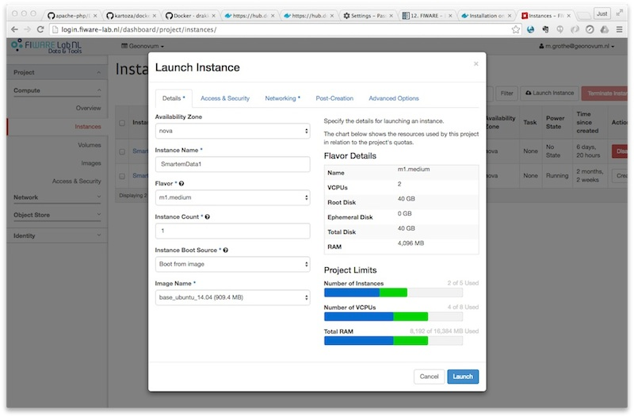

.. _notes:

=====
Notes
=====

This chapter various notes that were taken during the course of the project. Mostly these
are related to design/implemenation iterations, where a particular design or component was not
used further in the project, but we did not want to loose various details, as we may revisit
these technologies in another phase or project.

Calibration
===========

Within the SE project a separate activity is performed for gas-calibration based on Big Data Analysis
statistical methods. Values coming from SE sensors were compared to actual RIVM values. By matching predicted
values with RIVM-values, a formula for each gas-component is established and refined. The initial approach
was to use linear analysis methods. However, further along in the project the use
of `Artificial Neural Networks (ANN) <https://en.wikipedia.org/wiki/Artificial_neural_network>`_
appeared to be the most promising.

Below are notes from the (discarded) Linear Analysis approach for historic/future ref.
This was implemented and described in this GitHub repo:
https://github.com/pietermarsman/smartemission_calibration .
By using the R-language, reports in PDF are generated.

O3 Calibration
~~~~~~~~~~~~~~

O3 seemed to be the most linear. See the resulting `O3 PDF report <_static/calibration/O3.pdf>`_.

From the linear model comes the following formula for the conversion from resistance (kOhm) to ug/m3 (at 20C and 1013 hPa)  ::

	O3 = 89.1177
	+ 0.03420626 * s.coresistance * log(s.o3resistance)
	- 0.008836714 * s.light.sensor.bottom
	- 0.02934928 s.coresistance * s.temperature.ambient
	- 1.439367 * s.temperature.ambient * log(s.coresistance)
	+ 1.26521 * log(s.coresistance) * sqrt(s.coresistance)
	- 0.000343098 * s.coresistance * s.no2resistance
	+ 0.02761877 * s.no2resistance * log(s.o3resistance)
	- 0.0002260495 * s.barometer * s.coresistance
	+ 0.0699428 * s.humidity
	+ 0.008435412 * s.temperature.unit * sqrt(s.no2resistance)

SOS Services
============

We tested istSOS at an early stage.

istSOS - Install Test
---------------------

Notes from raw install as Python WSGI app, see also http://istsos.org/en/latest/doc/installation.html:  ::

	# as root
	$ mkdir /opt/istsos
	$ cd /opt/istsos
	# NB 2.3.0 gave problems, see https://sourceforge.net/p/istsos/tickets/41/
	$ wget https://sourceforge.net/projects/istsos/files/istsos-2.3.0.tar.gz
	$ tar xzvf istsos-2.3.0.tar.gz
	$ mv istsos 2.3.0
	$ ln -s 2.3.0 latest

	$ chmod 755 -R /opt/istsos/latest
	$ chown -R www-data:www-data /opt/istsos/latest/services
	$ chown -R www-data:www-data /opt/istsos/latest/logs
	$ mkdir /opt/istsos/latest/wns   # not present, need to create, no is for web notification service
	$ chown -R www-data:www-data /opt/istsos/latest/wns # not present, gives error (?)

Add WSGI app to Apache conf.

.. literalinclude:: ../../services/web/config/sites-enabled/000-default.conf
    :language: text

Setup the PostGIS database. ::

	$ sudo su - postgres
    $ createdb -E UTF8 -O sensors istsos
    Password:
    $ psql -d istsos -c 'CREATE EXTENSION postgis'
    Password:
    CREATE EXTENSION

Restart and test: ::

	$ service apache2 restart

	# in browser
	http://api.smartemission.nl/istsos/admin/

	# Database: fill in user/password

	# create service (creates DB schema) "sound"

    # test requests
    http://api.smartemission.nl/istsos/modules/requests/

    # REST
    http://api.smartemission.nl/istsos/wa/istsos/services/sound

Fiware
======

Initially it was planned to run the SE platform on Fiware, but due to technical problems
this was postponed and is still on hold.  Below some notes on installation.

The `Fiware Lab NL <http://fiware-lab.nl/>`_ provides a cloud-based computing infrastructure in particular
for "Smart City" applications. Based on the adopted "Docker-Strategy" for the
Smart Emission Data Platform as described within the :ref:`architecture` chapter,
this chapter will describe the actual "hands-on" installation steps.

In order to start installing Docker images and other tooling we need to "bootstrap" the system
within the Fiware environment.

Fiware Lab NL
-------------

Creating a (Ubuntu) VM in the Fiware Lab NL goes as follows.

* login at http://login.fiware-lab.nl/
* create an SSL keypair via http://login.fiware-lab.nl/dashboard/project/access_and_security/
* create a VM-instance via http://login.fiware-lab.nl/dashboard/project/instances/ `Launch Instance` button

   *Creating a Ubuntu VM instance in Fiware Lab NL*

See the popup image above, do the following selections in the various tabs:

* `Launch Instance` tab: select `boot from image`, select ``base_ubuntu_14.04``
* `Access&Security` tab: select keypair just created and enable all `security groups`
* `Networking` tab: assign both ``floating-IP`` and ``shared-net`` to `selected networks`
* other tabs: leave as is
* login via ``ssh -i <privkey_from_keypair>.pem ubuntu@<IP_address>``

