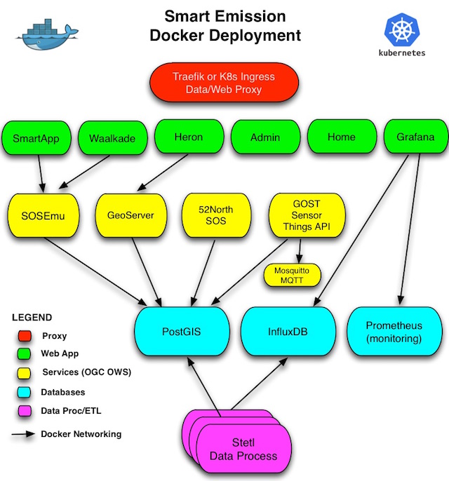

# Smart Emission Services

Each directory below provides a ``run`` script and config to run
Docker containers for the SE services. [ETL processing](../etl/README.md) and [apps](../apps/README.md) have
their own directories.

## Architecture

The image below shows the Docker deployment architecture: how all containers
link together. NB it is also possible to run just a subset of these containers.
For example just InfluxDB and Grafana.

## Links

* SE Platform doc: http://smartplatform.readthedocs.io/en/latest/
